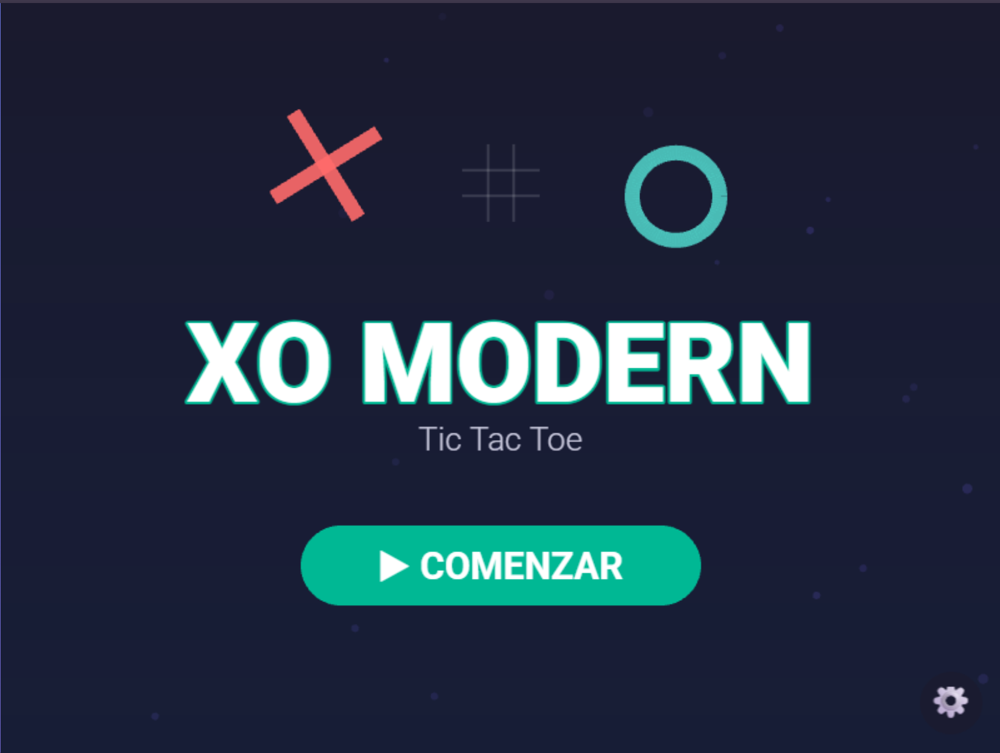
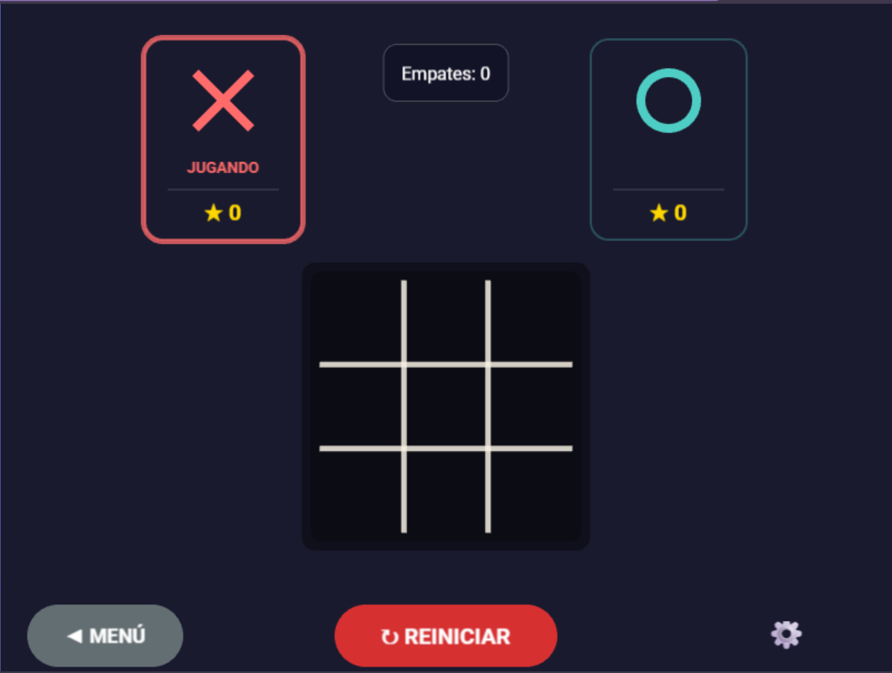

# XO Modern - Tic Tac Toe Game 🎮

Un juego moderno de Tic Tac Toe (3 en raya) construido con **Phaser 3**, con diseño moderno, animaciones fluidas y características avanzadas.


## ✨ Características

### 🎨 Visual y UX
- **Diseño moderno** con gradientes y efectos de brillo
- **Animaciones fluidas** para movimientos y transiciones
- **Partículas animadas** de fondo en cada pantalla
- **3 skins diferentes**: Clásico, Neón, y Retro
- **Modo oscuro/claro** configurable
- **Responsive design** adaptable a diferentes tamaños de pantalla

### 🎮 Modos de Juego
- **VS Humano**: Juega contra otro jugador local
- **VS IA Fácil**: Enfrenta a la inteligencia artificial

### 📐 Tamaños de Tablero
- **3×3**: Clásico y rápido
- **4×4**: Más desafiante
- **5×5**: Extremadamente complejo

### 👤 Personalización
- **Nombres de jugador personalizados** (solo modo VS Humano)
- Los nombres aparecen:
  - Durante el turno activo en las tarjetas de jugador
  - En la pantalla de victoria
- **Configuración accesible** desde cualquier pantalla del juego

### 🎯 Sistema de Puntuación
- Contador de victorias para X y O
- Registro de empates
- Se reinicia al volver al menú principal

## 🚀 Instalación y Desarrollo

### Prerrequisitos
- Node.js (versión 14 o superior)
- npm o yarn

### Instalación

```bash
# Clonar el repositorio
git clone https://github.com/[tu-usuario]/XO-Modern.git

# Entrar al directorio
cd XO-Modern

# Instalar dependencias
npm install
```

### Ejecutar en Desarrollo

```bash
npm start
# o
npm run dev
```

El juego se abrirá en `http://localhost:1234`

### Build de Producción

```bash
npm run build
```

Los archivos optimizados se generarán en la carpeta `dist/`

## 📁 Estructura del Proyecto

```
XO-Modern/
├── src/
│   ├── main.js              # Punto de entrada
│   ├── config.js            # Configuración de Phaser
│   ├── scenes/              # Escenas del juego
│   │   ├── MenuStep1.js     # Pantalla de inicio
│   │   ├── MenuStep2.js     # Selección de skin
│   │   ├── MenuStep3.js     # Selección de modo
│   │   ├── MenuStep4.js     # Selección de tamaño
│   │   ├── Game.js          # Juego principal
│   │   └── GameOver.js      # Pantalla de victoria
│   ├── objects/             # Objetos del juego
│   │   ├── Board.js         # Tablero
│   │   └── Piece.js         # Piezas X/O
│   └── utils/               # Utilidades
│       ├── UIHelper.js      # Helpers de UI
│       └── GameLogic.js     # Lógica del juego
├── public/                  # Assets públicos
├── index.html              # HTML principal
└── package.json            # Dependencias

```

## 🎮 Cómo Jugar

1. **Inicio**: Haz clic en "COMENZAR" en la pantalla principal
2. **Personaliza**: 
   - Selecciona tu skin favorito
   - Elige modo de juego (VS Humano o VS IA)
   - Selecciona tamaño del tablero (3×3, 4×4, o 5×5)
3. **Configura nombres** (opcional):
   - Haz clic en el botón ⚙️ en cualquier pantalla
   - Ingresa nombres para Jugador X y Jugador O
4. **Juega**:
   - Haz clic en las casillas del tablero para colocar tu símbolo
   - El primer jugador en completar una línea gana
5. **Disfruta**:
   - Observa las animaciones de victoria
   - Revisa los puntajes
   - Juega de nuevo o vuelve al menú

## 🛠️ Tecnologías Utilizadas

- **[Phaser 3](https://phaser.io/)** - Framework de juegos HTML5
- **[Parcel](https://parceljs.org/)** - Bundler sin configuración
- **JavaScript ES6+** - Lenguaje de programación
- **HTML5 Canvas** - Renderizado gráfico
- **CSS3** - Estilos adicionales

## 🎨 Características Técnicas

### Patrones de Diseño
- **Scene Management**: Organización modular en escenas
- **Component Pattern**: Objetos reutilizables (Board, Piece)
- **Utility Classes**: Helpers compartidos para UI y lógica

### Optimizaciones
- **Lazy Loading**: Carga de recursos bajo demanda
- **Object Pooling**: Reutilización de objetos gráficos
- **Event-driven**: Sistema de eventos eficiente
- **Build optimizado**: Minificación y tree-shaking con Parcel

### Animaciones
- **Tweens de Phaser**: Transiciones suaves
- **Particle Systems**: Efectos visuales dinámicos
- **Easings avanzados**: Cubic, Elastic, Back, etc.

## 📝 Configuración

El juego mantiene el estado en `window.gameState`:

```javascript
{
  skin: 'classic' | 'neon' | 'retro',
  mode: 'human' | 'ai',
  boardSize: 3 | 4 | 5,
  darkMode: boolean,
  soundEnabled: boolean,
  playerXName: string,
  playerOName: string,
  scores: {
    x: number,
    o: number,
    draws: number
  }
}
```

## 🤝 Contribución

Las contribuciones son bienvenidas. Para cambios importantes:

1. Fork el proyecto
2. Crea una rama para tu feature (`git checkout -b feature/AmazingFeature`)
3. Commit tus cambios (`git commit -m 'Add some AmazingFeature'`)
4. Push a la rama (`git push origin feature/AmazingFeature`)
5. Abre un Pull Request

## 📄 Licencia

Este proyecto está bajo la Licencia MIT - ver el archivo [LICENSE](LICENSE) para más detalles.

## 👨‍💻 Autor

**Tu Nombre**
- GitHub: [@tu-usuario](https://github.com/tu-usuario)

## 🙏 Agradecimientos

- Phaser Team por el excelente framework
- Comunidad de desarrolladores de juegos HTML5
- Inspiración de diseño moderno de UI/UX

## 📸 Screenshots

### Juego en Acción


### Pantalla Principal



---

⭐ Si te gusta este proyecto, considera darle una estrella en GitHub!
